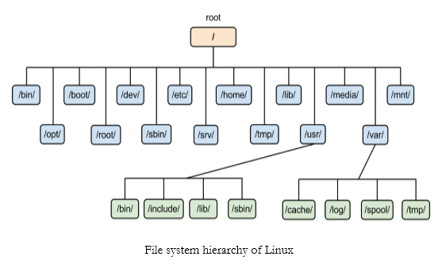

# 리눅스는 무엇인가요?
Linux는 시스템을 운영하는데 가장 널리 사용되는 운영체제이다. Windows 시스템이나 application이 아닌 이상 일반적으로 시스템 서버는 linux 기반으로 운영되고 있다.
CPU, 메모리, 스토리지처럼 시스템의 하드웨어와 리소스를 직접 관리하는 소프트웨어

다중 사용자, 다중 작업(멀티태스킹), 다중 스레드를 지원하는 네트워크 운영체제(NOS)이다.

### 리눅스의 특징
1. 리눅스는 공개 운영체제이다. 오픈소스로 누구든지 자유롭게 사용하고 수정할 수 있다.
2. PC용 OS보다 안정적이며 보안에서도 우수한 성능을 가지고 있다.
3. 유닉스와 완벽하게 호환가능하다.
(유닉스는 교육 및 연구 기관에서 즐겨 사용되는 범용 다중 사용자 방식의 시분할 운영 체제로 멀티 태스킹과 다중 사용자를 지원하도록 설계되었다)

### 리눅스의 종류
1. 레드햇계열 : 센토스OS
2. 데비안계열 : 우분투

# 리눅스는 누가 만들었을까요?

1991년에 Linus Torvals가 개발 
이전에는 소프트웨어 개발자이자 리눅스 커널과 깃을 최초로 개발하고, 현재는 프로젝트 코디네이터로 활동하고 있다.

# 리눅스의 루트경로는 무엇일까요?
### 리눅스의 파일 경로(Linux File System Hierarchy (FHS))

- 가장 위에 / 디렉토리가 Root 디렉토리 (directory) 이다.
- 하위의 각 디렉토리들은 slash(/)로 구분한다.(/var/log/)
- 폴더 이동은 change directory의 약자인 cd로 할 수 있다. (cd /var/log)
- 루트 디렉토리로 이동은 cd / 로 할 수 있다.

# 리눅스의 홈 디렉토리는 무엇일까요?
home 디렉토리는 유저가 사용하는 공간이며, 가장 중요하고 기본이 되는 디렉토리이다. 
위에서 다뤘던 cd명령어를 실행할 때 다른 경로 없이 cd만 실행해도 home 디렉토리로 이동할 수 있다. 